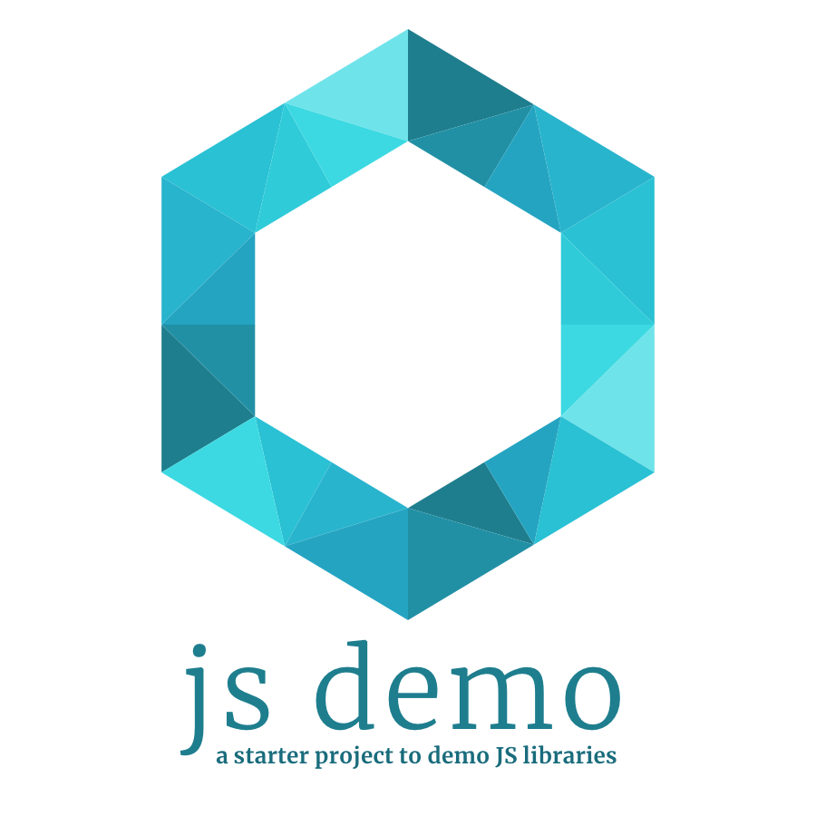

<p align="center"></p>

# js demo

> A starter project to demo JS libraries

## Features

Layout

- Navigation
- Pages
- Info section
- Attractive design
- Example logo + favicon

UI components

- Input
- Select
- Modal
- Table
- Icon

Functionality

- Built on Vue
- Code Sandbox integration
- Routing
- Vuex

Libraries

- Vue
- Vuex
- Vue Router
- Axios
- Bulma

## Demo

Visit:

- https://js-demo.netlify.com/

## Setup

Install and run:

```bash
npm install
npm run dev
```

View at [http://localhost:8080](http://localhost:8080).


