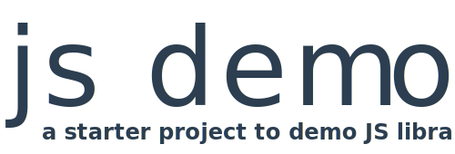

<p align="center"></p>
<p align="center"></p>

# js demo

> A starter project to demo JS libraries

## Overview

JS Demo is a small start project to demo JS libs.

It scaffolds a lightweight layout, navigation and theme based on Vue and Bulma, allowing you to concentrate on setting up pages to demo your library's features.


## Installation

Clone to the `demo/` folder of your local repository, under `demo/`.

Then, install and run:

```bash
cd demo
npm install
npm run dev
```

View at [http://localhost:8080](http://localhost:8080)


## Features

Layout

- Navigation
- Pages
- Markdown support
- Attractive design
- Example logo + favicon
- Info section for examples

UI components

- Input
- Select
- Modal
- Table
- Icon

Configuration

- Single [navigation / routes](https://github.com/davestewart/js-demo/blob/master/src/app/config/navgation.js) configuration file
- Single [site](https://github.com/davestewart/js-demo/blob/master/src/app/config/site.js) configuration file
- Store [already set up](https://github.com/davestewart/js-demo/blob/master/src/app/data/store.js)
- Various [sample pages](https://github.com/davestewart/js-demo/tree/master/src/app/pages) ready to go

Integration / Links

- Documentation
- Demo site (recommends Netlify)
- GitHub
- Google Analytics
- Code Sandbox


Functionality

- Built on Vue
- [CodeSandbox](https://codesandbox.io/) integration
- Routing
- Vuex

Libraries

- [Vue](https://vuejs.org/)
- [Vuex](https://vuex.vuejs.org/)
- [Vue Router](https://router.vuejs.org/)
- [Axios](https://github.com/axios/axios)
- [Bulma](https://bulma.io/)

## Demo

Editable demo:

- [codesandbox.io/s/github/davestewart/js-demo](https://codesandbox.io/s/github/davestewart/js-demo)

Live site:

- [js-demo.netlify.com](https://js-demo.netlify.com)
